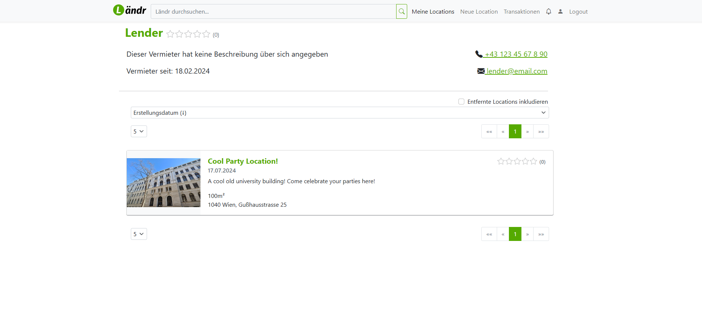
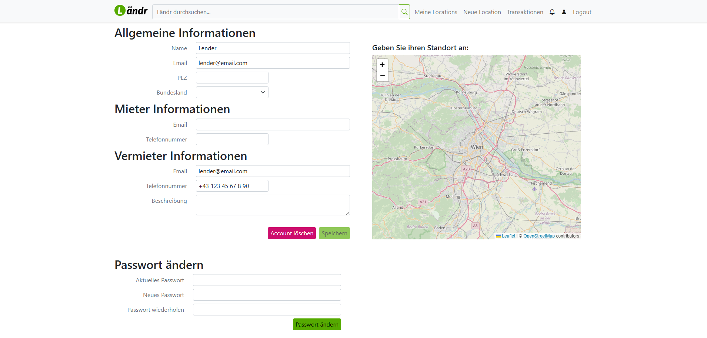

# Ländr

Ländr: Your go-to platform for easily finding and booking the best party locations.

## Concept

Ländr, your party location finder. No more need to search for hours to find a location suitable for your wedding or graduation party, we got you covered. With our custom reputation system, you know for sure, that your lender or renter will be trustworthy!

## Workflow

Two types of users can interact with lender, performing different tasks with different intents: <u>Lenders</u>, who offer they location, and <u>Renters</u> who search for a suitable location.

Lenders are able to lend their location for a given time period by:
- Create a new location (with name, address, size, position on a map, images)!
- Create timeslots for the given location, either for several consecutive hours or up to several days, it's up to you!
- Wait for your first renter requests

Renters are able to request a location for rent:
- Take a look at the start page with all available locations
- Filter the available locations to find your perfect match
- Initiate a request with the lender

Once a rent request is confirmed, a transaction is created and after the transaction time window is closed (after the planed rent date), the renter and lender are requested to rate their transaction partner.

## Technical Implementation

Ländr has been implemented as a classical three-layer architecture, with a frontend layer (using Angular, Typescript and Bootstrap), a backend layer (using Java, SpringBoot and JPA) and a database layer (using H2).

## Features

### Gamification

The users are requested to rate other transaction partners. If they do, their rating completition score gets increased and is shown on their start page.

## Screenshots

Create a new location available for rent

Create new timeslots for your newly created location

View a list of your own created party locations

View a list of currated locations, recommended using our custom algorithm

Check out our top recommended locations

Filter locations using a price range, a date range, an address, tags and a marker on a map

Filter locations using a map, a location pin and a range, in addition to the previous filters

Request a location from an existing timeslot as a renter

Preview a list of all transactions, all states combined (Requested, Accepted, Completed, Completed & Rated, Cancelled)

Complete a transaction and enter the paid price

Rate your transactions as renter or as lender once completed

Rate your transactions to increase your rating score (Gamification)

Change your personal data as Lender

## Collaborators
- [Raphael-Zeiler](https://github.com/Raphael-Zeiler)
- [benjaminkasper99](https://github.com/benjaminkasper99)
- [Sakrafux](https://github.com/Sakrafux)
